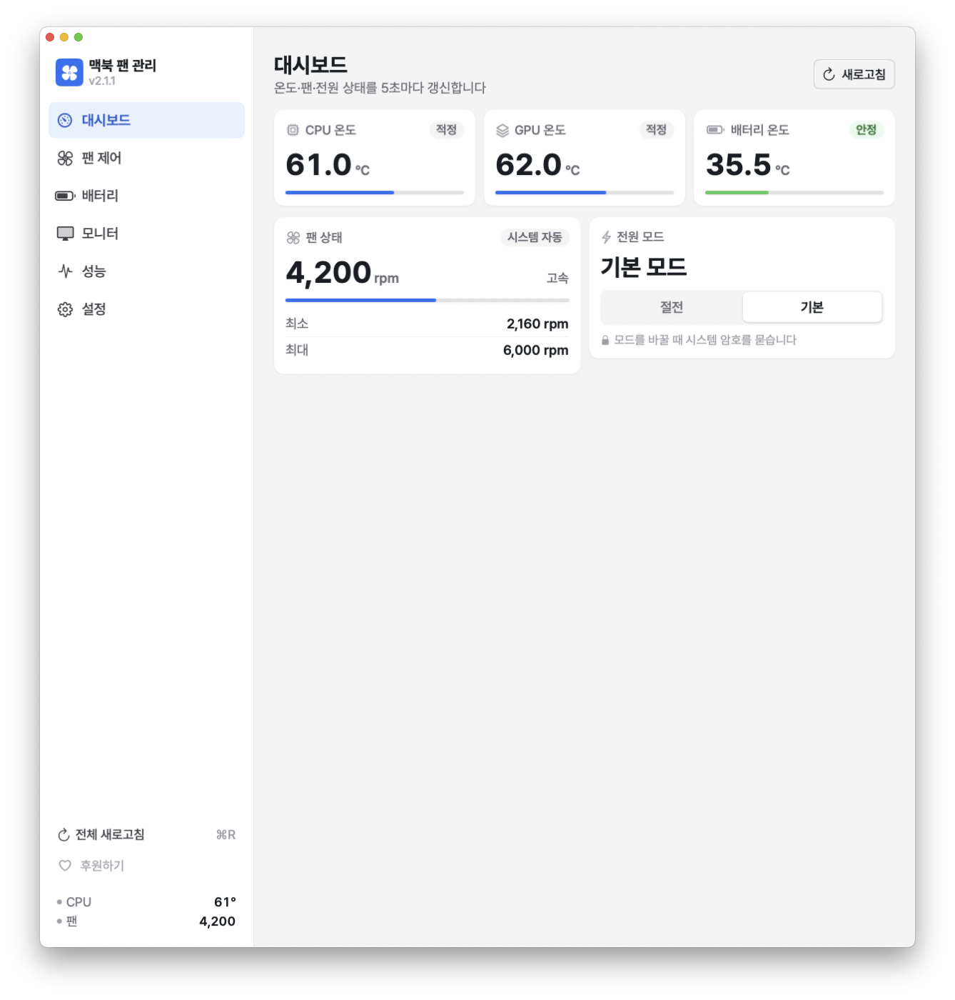
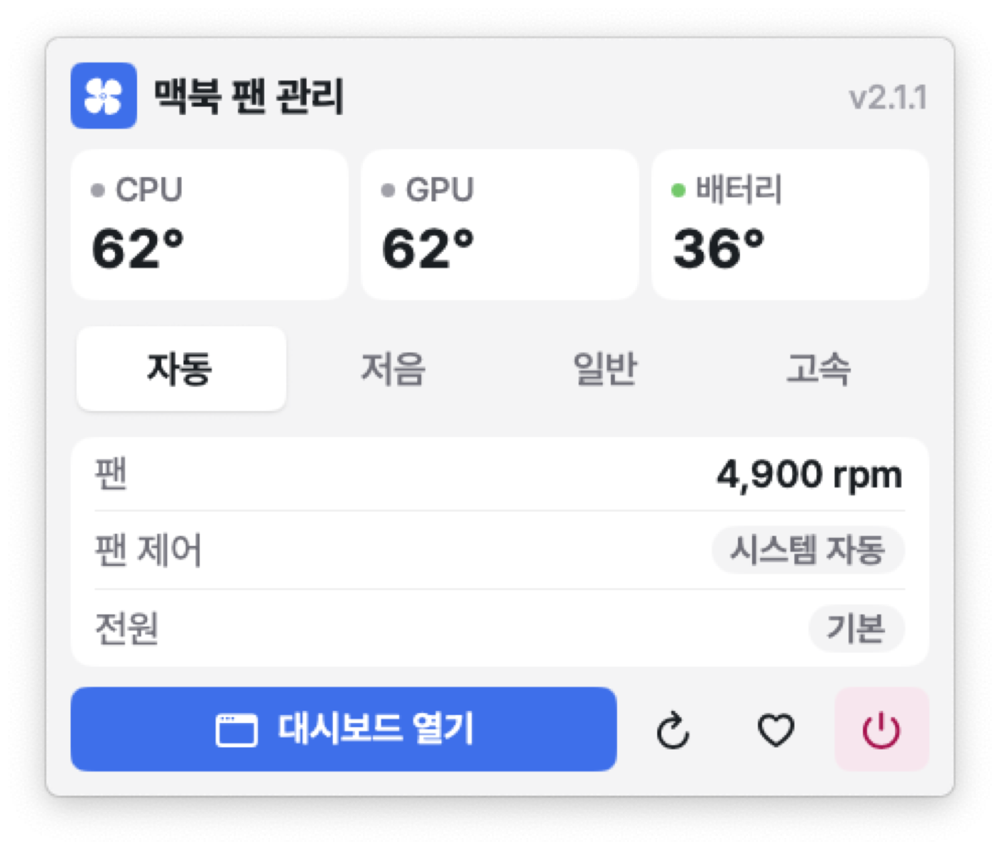
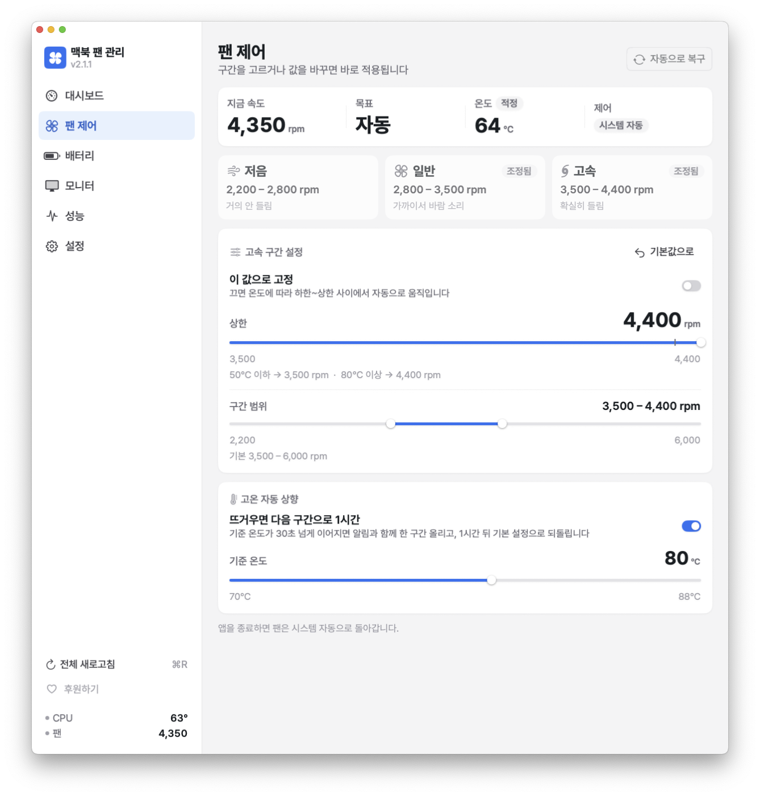
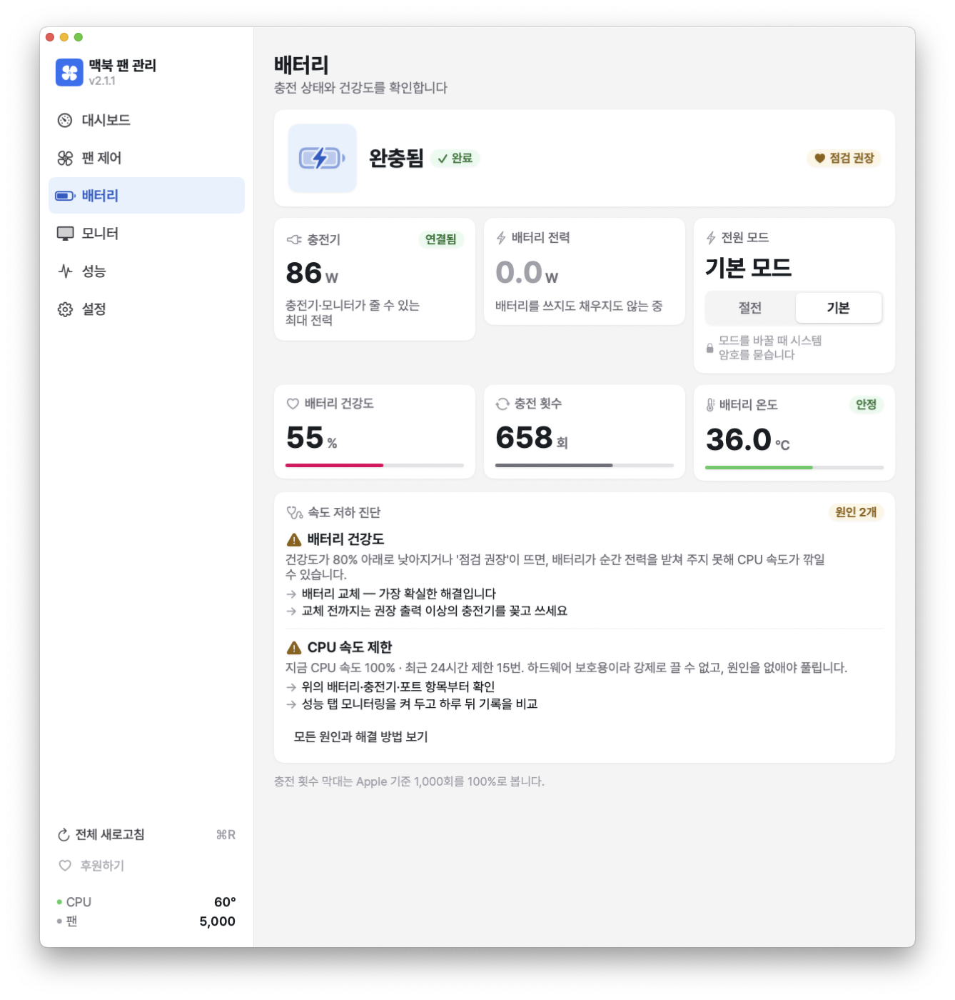
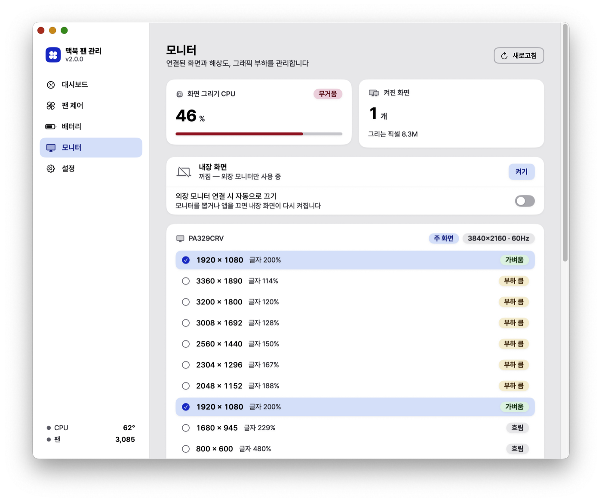
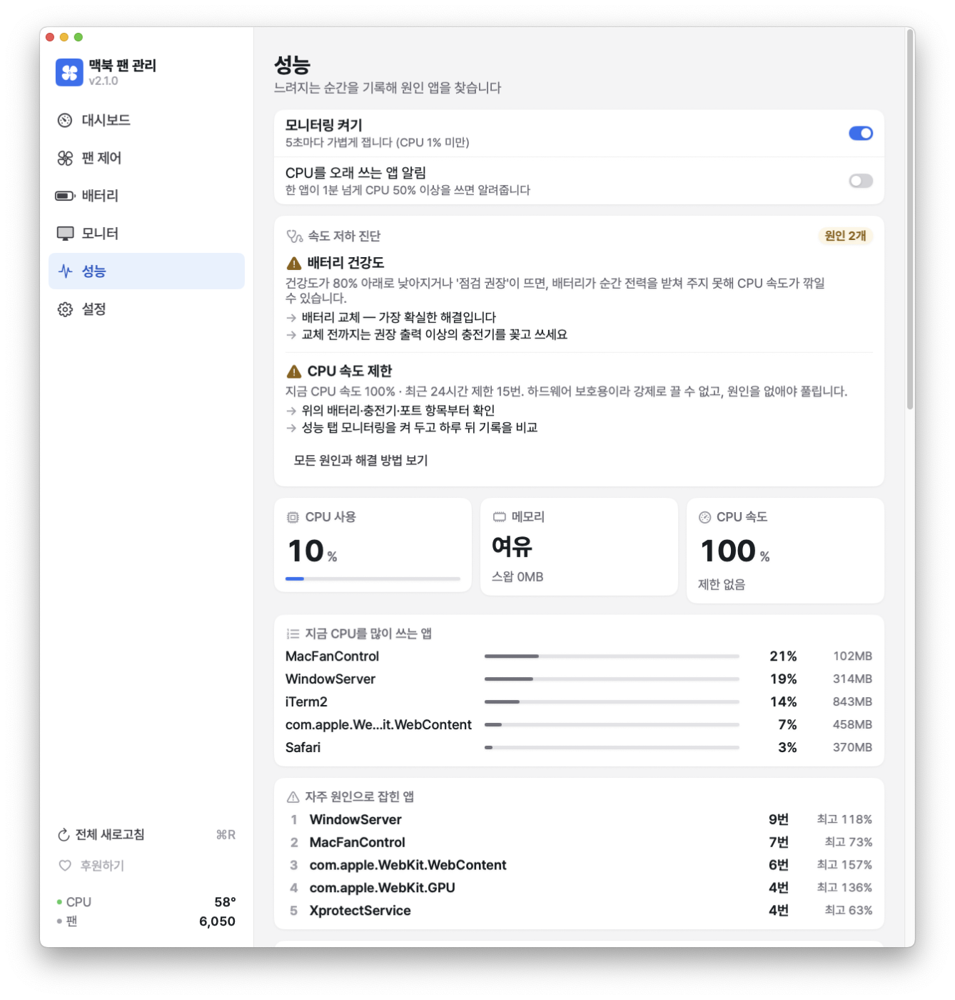
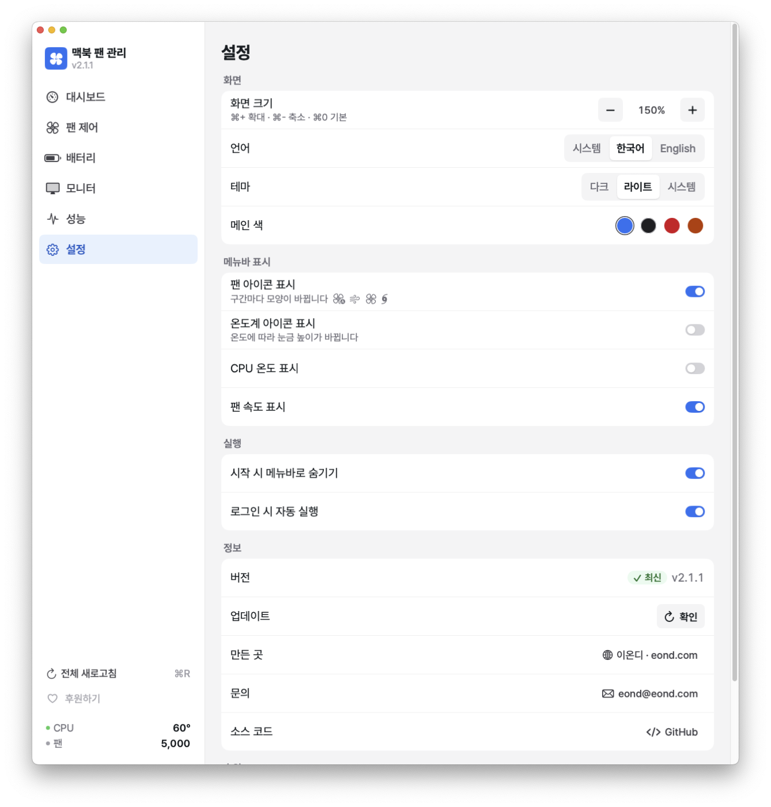

# MacFanControl

Intel MacBook용 팬 소음·전원 관리 SwiftUI 앱. macOS 13(Ventura)+ 지원.


> v2.0부터 Swift+SwiftUI로 재작성. 이전 Python+tkinter 버전은 [`v1.5.2-python`](../../tree/v1.5.2-python) 태그.

## 기능

| 기능 | 설명 |
|------|------|
| **메뉴바 상주** | CPU 온도·팬 RPM 실시간 표시 |
| **전원 모드** | 절전 / 기본 전환 (`pmset lowpowermode`) |
| **팬 제어** | 1,200–6,000 rpm 슬라이더 + 저속/일반/고성능 프리셋 |
| **자동 모드 복구** | macOS 기본 팬 제어로 즉시 복귀 |
| **배터리 정보** | 충전 횟수, 건강도, 잔여 시간, 상태 |
| **SMC 직접 접근** | IOKit으로 직접 통신 — 외부 바이너리 의존성 없음 |
| **충전 전력** | 충전기(USB-C 모니터 포함) 정격 W, 배터리 충전·방전 W |
| **모니터** | 내장 화면 끄기·켜기(외장 연결 시 자동), 해상도별 배율·그래픽 부하, 연결 방식(USB-C·DisplayPort/HDMI) |
| **색상 프로필** | 패널 색 영역과 비교해 과포화·바램·선형 감마 진단, 추천 프로필 바로 적용 |
| **성능 모니터링** | CPU·메모리·스왑·CPU 속도 제한 기록, 자주 원인으로 잡힌 앱, CPU 과다 사용 알림 |
| **속도 저하 진단** | 배터리 건강도·충전기 출력·절전 모드·속도 제한별 원인과 해결 방법 안내 |
| **화면 배율** | ⌘+ / ⌘- / ⌘0, 전체 새로고침 ⌘R |

## 스크린샷

| 대시보드 | 메뉴바 |
|---|---|
|  |  |

| 팬 제어 | 배터리 |
|---|---|
|  |  |

| 모니터 | 성능 |
|---|---|
|  |  |

| 설정 | |
|---|---|
|  | |

## 설치 (배포판)

[Releases](../../releases) 페이지에서 DMG 다운로드 후 설치.

> **처음 실행 시**: 우클릭 → **열기** (Apple 미서명 앱 Gatekeeper 우회)

## 소스에서 빌드

### 요구사항
- macOS 13.0 (Ventura) 이상
- Xcode 15 이상
- [XcodeGen](https://github.com/yonaskolb/XcodeGen) — `brew install xcodegen`

### 빌드

```bash
git clone https://github.com/eondcom/mac-fan-control.git
cd mac-fan-control
xcodegen generate
open MacFanControl.xcodeproj
```

Xcode에서 ⌘R로 실행.

### 코드 서명 (배포용)
`project.yml`의 `DEVELOPMENT_TEAM` 필드에 Apple Developer Team ID 입력 후 `xcodegen generate`.

## 디렉터리 구조

```
App/
├── MacFanControlApp.swift   # @main, MenuBarExtra
├── AppState.swift           # 중앙 ObservableObject
├── Views/                   # SwiftUI 화면
│   ├── MenuBarView.swift    # 메뉴바 팝오버 패널
│   ├── ContentView.swift    # 대시보드 TabView
│   ├── DashboardView.swift
│   ├── FanControlView.swift
│   ├── BatteryView.swift
│   └── SettingsView.swift
├── SMC/                     # IOKit + SMC key 읽기/쓰기
│   ├── SMC.swift
│   └── SMCKeys.swift
├── System/                  # 시스템 정보 래퍼
│   ├── Thermal.swift
│   ├── PowerMode.swift
│   └── Battery.swift
├── Updater/
│   └── ReleaseChecker.swift # GitHub Releases API
└── Resources/
    ├── Info.plist
    └── Assets.xcassets/
```

## SMC 접근 안내

이 앱은 [SMCKit](https://github.com/beltex/SMCKit) 패턴을 참고해 IOKit으로 SMC에 직접 접근합니다.
외부 `smc` 바이너리(`smcFanControl` 등) 설치가 **불필요**합니다.

팬 제어 동작:
- 읽기: `F0Ac`(현재 RPM), `F0Mn`/`F0Mx`(최소/최대), `F0Md`(0=자동, 1=수동)
- 쓰기: `F0Md = 1` + `F0Tg = 목표 RPM` (FLT 형식 우선, 실패 시 FPE2)
- 자동 복귀: `F0Md = 0`

## 후원

앱이 도움이 됐다면 후원해 주세요. 광고 없이 무료로 유지하는 데 쓰입니다.

- 해외: [PayPal](https://paypal.me/eond)
- 국내: [카카오페이 송금](https://qr.kakaopay.com/Ej7jeAAOU) (PC에서 열면 휴대폰으로 찍는 QR이 나옵니다)

## 라이선스

MIT.
